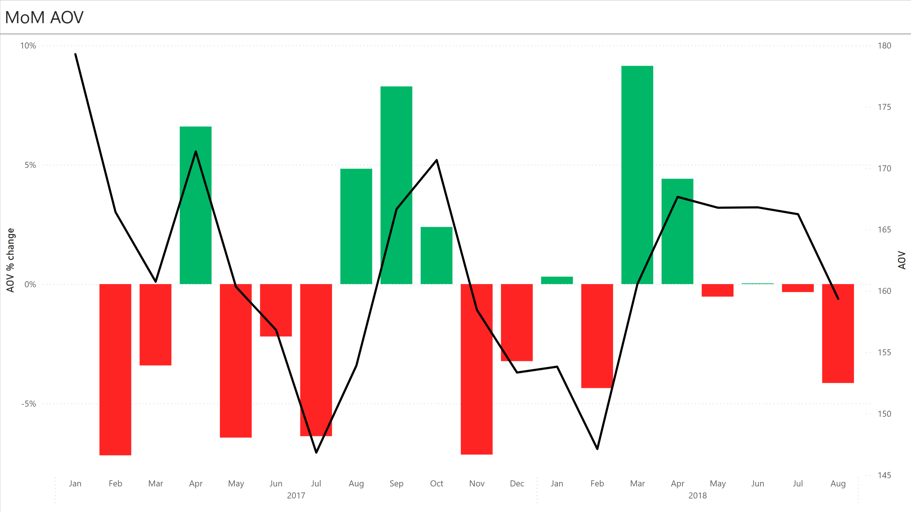

## Navigation

- [Analysis Projects](https://github.com/alainfkhan/data-projects-projects)
- [**Olist**](https://github.com/alainfkhan/data-projects-projects/blob/main/static/olistbr/README.md)
  - [rebuild-db](https://github.com/alainfkhan/data-projects-projects/blob/main/static/olistbr/rebuild-db/README.md)

# Olist

## Read more

> - [Context](CONTEXT.md) (Business, Brazil)
> - [Preamble](PREAMBLE.md) (Code, Definitions, Assumptions)

<!-- > [Report](REPORT.md) (Fuller version) -->

---

## Executive summary

Olist ERD (Entity Relationship Diagram):

- Shows the relationships between tables.
- There are two dataset groups:
  - 'Brazilian e-commerce public dataset' (big blue background, left, contains 9 tables)
  - 'Marketing funnel by Olist' (small orange background, bottom right, contains 2 tables)
- A solid line between two tables represent an active relation,
  while a dashed line represent an inactive relation.
- An active relation is a foreign key constraint defined within the Data Definition Language (DDL).
- For example:
  - There is an active 1-many relation between `dim_sellers` and `fact_order_items`.
  - There is an inactive many-many relation between `dim_sellers` and `fact_geolocation`.
  - There is an inactive 1-1 relation between `fact_closed_deals` and `fact_marketing_qualified_leads`.

---

'Today' is [`2018-08-22`](PREAMBLE.md/#main-assumptions).

### Average Order Values (AOV) Analysis

The MTD AOV (for 2018-08) is -4.14%.

View table

| year_number | month_number | order_count | gmv              | aov        | aov_periodic |
| ----------- | ------------ | ----------- | ---------------- | ---------- | ------------ |
| 2017        | 1            | 711         | R\$ 127.473,40   | R\$ 179,29 | NULL         |
| 2017        | 2            | 1703        | R\$ 283.417,00   | R\$ 166,42 | -7.18%       |
| 2017        | 3            | 2626        | R\$ 422.126,80   | R\$ 160,75 | -3.41%       |
| 2017        | 4            | 2352        | R\$ 403.041,70   | R\$ 171,36 | 6.60%        |
| 2017        | 5            | 3642        | R\$ 583.950,80   | R\$ 160,34 | -6.43%       |
| 2017        | 6            | 3214        | R\$ 504.008,70   | R\$ 156,82 | -2.20%       |
| 2017        | 7            | 3899        | R\$ 572.464,80   | R\$ 146,82 | -6.37%       |
| 2017        | 8            | 4296        | R\$ 661.237,80   | R\$ 153,92 | 4.83%        |
| 2017        | 9            | 4248        | R\$ 708.002,10   | R\$ 166,67 | 8.28%        |
| 2017        | 10           | 4512        | R\$ 770.001,80   | R\$ 170,66 | 2.39%        |
| 2017        | 11           | 7280        | R\$ 1.153.615,00 | R\$ 158,46 | -7.14%       |
| 2017        | 12           | 5782        | R\$ 886.659,00   | R\$ 153,35 | -3.23%       |
| 2018        | 1            | 7108        | R\$ 1.093.390,00 | R\$ 153,83 | 0.31%        |
| 2018        | 2            | 6604        | R\$ 971.593,90   | R\$ 147,12 | -4.36%       |
| 2018        | 3            | 7249        | R\$ 1.163.999,00 | R\$ 160,57 | 9.14%        |
| 2018        | 4            | 6758        | R\$ 1.133.211,00 | R\$ 167,68 | 4.43%        |
| 2018        | 5            | 7026        | R\$ 1.171.781,00 | R\$ 166,78 | -0.54%       |
| 2018        | 6            | 6142        | R\$ 1.024.519,00 | R\$ 166,81 | 0.02%        |
| 2018        | 7            | 6125        | R\$ 1.018.432,00 | R\$ 166,27 | -0.32%       |
| 2018        | 8            | 5823        | R\$ 928.091,20   | R\$ 159,38 | -4.14%       |

#### What affects AOV?

In any given time frame (say a month):

$$
AOV = \frac{GMV}{\text{total order count}}
$$

$$
GMV = (\text{total product revenue}) + (\text{total freight revenue})
$$

$$
\Rightarrow AOV = \frac{(\text{total product revenue} ) + (\text{total freight revenue})}{\text{total order count}}
$$

So:

$$
\text{total product revenue} \propto AOV
$$

$$
\text{total freight revenue} \propto AOV
$$

$$
\frac{1}{\text{total order count}} \propto AOV
$$

Revenue is generated whenever a sale is realised and measurable.

A sale is realised whenever the `order_status` of an order transaction is any of:

- `approved`
- `delivered`
- `invoiced`
- `processing`
- `shipped`

A sale is measurable whenever the product `price` is listed.
It is given that whenever `price` exists, `freight_value` also exists.

From the AOV formula above, factors that increase AOV would be:

- Any increase in total product revenue:
  - the propensity the `order_status` has at being a value that classifies the order as a realised sale (`approved`, `delivered`, ...)
  - the propensity the `price` has of being listed
- Any increase in total freight revenue.
- Any decrease in total order count.

### Future orders

#### How likely will the next order be a realised sale (after the settlement period)?

Historically, ~98.8% of orders eventually become a realised sale.

Assuming:

- stationarity: the environment stays the same (operations, sellers, logistics),
- independence: orders don't influence other orders,
- homogeneity: all orders share the same probability,

a reasonable baseline estimate of a sale would be ~98.8%.

View table

| is_realised_sale | count_order_status | pc      |
| ---------------- | ------------------ | ------- |
| 0                | 1239               | 1.246%  |
| 1                | 98202              | 98.754% |

[View query](queries/analysis/report/sales/realised_sale_propensity.sql)

#### Why did AOV decrease this month?

### Revenue by product category and business segment

Revenue by product category (top 10 GMV):

View table

| product_category_name  | product_category_name_english | order_count | gmv              | aov       | product_category_concentration |
| ---------------------- | ----------------------------- | ----------- | ---------------- | --------- | ------------------------------ |
| beleza_saude           | health_beauty                 | 8656        | R\$ 1.414.270,00 | R\$163.39 | 9.08%                          |
| relogios_presentes     | watches_gifts                 | 5558        | R\$ 1.288.340,00 | R\$231.80 | 8.27%                          |
| cama_mesa_banho        | bed_bath_table                | 9329        | R\$ 1.231.173,00 | R\$131.97 | 7.90%                          |
| esporte_lazer          | sports_leisure                | 7601        | R\$ 1.139.283,00 | R\$149.89 | 7.31%                          |
| informatica_acessorios | computers_accessories         | 6590        | R\$ 1.045.599,00 | R\$158.66 | 6.71%                          |
| moveis_decoracao       | furniture_decor               | 6340        | R\$ 889.022,80   | R\$140.22 | 5.71%                          |
| utilidades_domesticas  | housewares                    | 5766        | R\$ 762.756,60   | R\$132.29 | 4.90%                          |
| cool_stuff             | cool_stuff                    | 3589        | R\$ 699.434,50   | R\$194.88 | 4.49%                          |
| automotivo             | auto                          | 3827        | R\$ 673.413,90   | R\$175.96 | 4.32%                          |
| ferramentas_jardim     | garden_tools                  | 3486        | R\$ 576.707,20   | R\$165.44 | 3.70%                          |

Revenue by business segment (top 10 GMV)

View table

| business_segment                | order_count | gmv            | aov        | business_segment_concentration |
| ------------------------------- | ----------- | -------------- | ---------- | ------------------------------ |
| watches                         | 576         | R\$ 125.545,60 | R\$ 217,96 | 16.60%                         |
| health_beauty                   | 689         | R\$ 102.331,50 | R\$ 148,52 | 13.53%                         |
| household_utilities             | 483         | R\$ 62.121,90  | R\$ 128,62 | 8.21%                          |
| audio_video_electronics         | 243         | R\$ 56.519,29  | R\$ 232,59 | 7.47%                          |
| home_decor                      | 346         | R\$ 52.507,61  | R\$ 151,76 | 6.94%                          |
| small_appliances                | 65          | R\$ 49.260,73  | R\$ 757,86 | 6.51%                          |
| pet                             | 237         | R\$ 41.734,10  | R\$ 176,09 | 5.52%                          |
| construction_tools_house_garden | 258         | R\$ 36.849,86  | R\$ 142,83 | 4.87%                          |
| car_accessories                 | 146         | R\$ 33.845,05  | R\$ 231,82 | 4.47%                          |
| home_appliances                 | 133         | R\$ 28.793,67  | R\$ 216,49 | 3.81%                          |

### Product weight and freight cost correlation

Chose significant if `n` > average(`n`)

View table

| product_category_name_english | n     | corr_weight_freight |
| ----------------------------- | ----- | ------------------- |
| health_beauty                 | 9670  | 0.697               |
| sports_leisure                | 8641  | 0.668               |
| toys                          | 4117  | 0.652               |
| furniture_decor               | 8334  | 0.65                |
| garden_tools                  | 4347  | 0.633               |
| auto                          | 4235  | 0.632               |
| housewares                    | 6964  | 0.609               |
| electronics                   | 2767  | 0.602               |
| cool_stuff                    | 3796  | 0.587               |
| baby                          | 3064  | 0.583               |
| pet_shop                      | 1947  | 0.523               |
| computers_accessories         | 7827  | 0.523               |
| bed_bath_table                | 11115 | 0.469               |
| office_furniture              | 1691  | 0.411               |
| stationery                    | 2517  | 0.388               |
| fashion_bags_accessories      | 2031  | 0.345               |
| perfumery                     | 3419  | 0.335               |
| telephony                     | 4545  | 0.116               |
| watches_gifts                 | 5991  | 0.055               |

[View query](queries/analysis/report/_scratch/04_product-analysis/02_weight_vs_freight.sql)

### Average delivery time by customer state

### Seller concentration through time

---
