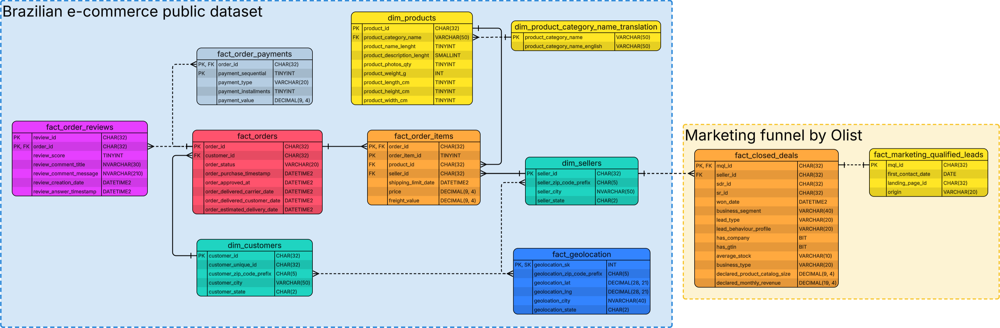

## Navigation

- [Analysis Projects](https://github.com/alainfkhan/data-projects-projects)
- [**Olist**](https://github.com/alainfkhan/data-projects-projects/blob/main/static/olistbr/README.md)
  - [rebuild-db](https://github.com/alainfkhan/data-projects-projects/blob/main/static/olistbr/rebuild-db/README.md)

# Olist

## Read more from this project

> - [Context](CONTEXT.md) (Business, Brazil)
> - [Preamble](PREAMBLE.md) (Code, Definitions, Assumptions)

<!-- > [Report](REPORT.md) (Fuller version) -->

---

## Executive summary

Entity Relationship Diagram (ERD):

- Shows the relationships between tables.
- There are two dataset groups:
  - 'Brazilian e-commerce public dataset' (big blue background, left, contains 9 tables)
  - 'Marketing funnel by Olist' (small orange background, bottom right, contains 2 tables)
- Solid lines between tables represent an active relation,
  while dashed lines represent an inactive relation.
- For example:
  - There is an active 1-many relation between `dim_sellers` and `fact_order_items`.
  - There is an inactive many-many relation between `dim_sellers` and `fact_geolocation`.
  - There is an inactive 1-1 relation between `fact_closed_deals` and `fact_marketing_qualified_leads`.

---

### Month on month Average Order Values (AOV)

| year_number | month_number | order_count | gmv              | aov              | aov_periodic |
| ----------- | ------------ | ----------- | ---------------- | ---------------- | ------------ |
| 2017        | 1            | 711         | R\$ 127.473,40   | R\$ 112.013,20   | NULL         |
| 2017        | 2            | 1703        | R\$ 283.417,00   | R\$ 245.119,90   | 118.83%      |
| 2017        | 3            | 2626        | R\$ 422.126,80   | R\$ 364.630,50   | 48.76%       |
| 2017        | 4            | 2352        | R\$ 403.041,70   | R\$ 351.603,10   | -3.57%       |
| 2017        | 5            | 3642        | R\$ 583.950,80   | R\$ 504.549,00   | 43.50%       |
| 2017        | 6            | 3214        | R\$ 504.008,70   | R\$ 433.880,50   | -14.01%      |
| 2017        | 7            | 3899        | R\$ 572.464,80   | R\$ 487.043,80   | 12.25%       |
| 2017        | 8            | 4296        | R\$ 661.237,80   | R\$ 567.237,30   | 16.47%       |
| 2017        | 9            | 4248        | R\$ 708.002,10   | R\$ 611.956,70   | 7.88%        |
| 2017        | 10           | 4512        | R\$ 770.001,80   | R$ 665.875,90    | 8.81%        |
| 2017        | 11           | 7280        | R\$ 1.153.615,00 | R\$ 988.510,30   | 48.45%       |
| 2017        | 12           | 5782        | R\$ 886.659,00   | R\$ 763.775,90   | -22.73%      |
| 2018        | 1            | 7108        | R\$ 1.093.390,00 | R\$ 938.480,30   | 22.87%       |
| 2018        | 2            | 6604        | R\$ 971.593,90   | R\$ 830.761,30   | -11.48%      |
| 2018        | 3            | 7249        | R\$ 1.163.999,00 | R\$ 990.843,60   | 19.27%       |
| 2018        | 4            | 6758        | R\$ 1.133.211,00 | R\$ 973.927,60   | -1.71%       |
| 2018        | 5            | 7026        | R\$ 1.171.781,00 | R\$ 1.014.741,00 | 4.19%        |
| 2018        | 6            | 6142        | R\$ 1.024.519,00 | R\$ 867.687,00   | -14.49%      |
| 2018        | 7            | 6125        | R\$ 1.018.432,00 | R\$ 859.923,90   | -0.89%       |
| 2018        | 8            | 5823        | R\$ 928.091,20   | R\$ 788.869,10   | -8.26%       |

### Revenue by product category and business segment

Revenue by product category (top 10 GMV):

| product_category_name  | product_category_name_english | order_count | gmv              | aov       | product_category_concentration |
| ---------------------- | ----------------------------- | ----------- | ---------------- | --------- | ------------------------------ |
| beleza_saude           | health_beauty                 | 8656        | R\$ 1.414.270,00 | R\$163.39 | 9.08%                          |
| relogios_presentes     | watches_gifts                 | 5558        | R\$ 1.288.340,00 | R\$231.80 | 8.27%                          |
| cama_mesa_banho        | bed_bath_table                | 9329        | R\$ 1.231.173,00 | R\$131.97 | 7.90%                          |
| esporte_lazer          | sports_leisure                | 7601        | R\$ 1.139.283,00 | R\$149.89 | 7.31%                          |
| informatica_acessorios | computers_accessories         | 6590        | R\$ 1.045.599,00 | R\$158.66 | 6.71%                          |
| moveis_decoracao       | furniture_decor               | 6340        | R\$ 889.022,80   | R\$140.22 | 5.71%                          |
| utilidades_domesticas  | housewares                    | 5766        | R\$ 762.756,60   | R\$132.29 | 4.90%                          |
| cool_stuff             | cool_stuff                    | 3589        | R\$ 699.434,50   | R\$194.88 | 4.49%                          |
| automotivo             | auto                          | 3827        | R\$ 673.413,90   | R\$175.96 | 4.32%                          |
| ferramentas_jardim     | garden_tools                  | 3486        | R\$ 576.707,20   | R\$165.44 | 3.70%                          |

Revenue by business segment (top 10 GMV)

| business_segment                | order_count | gmv            | aov        | business_segment_concentration |
| ------------------------------- | ----------- | -------------- | ---------- | ------------------------------ |
| watches                         | 576         | R\$ 125.545,60 | R\$ 217,96 | 16.60%                         |
| health_beauty                   | 689         | R\$ 102.331,50 | R\$ 148,52 | 13.53%                         |
| household_utilities             | 483         | R\$ 62.121,90  | R\$ 128,62 | 8.21%                          |
| audio_video_electronics         | 243         | R\$ 56.519,29  | R\$ 232,59 | 7.47%                          |
| home_decor                      | 346         | R\$ 52.507,61  | R\$ 151,76 | 6.94%                          |
| small_appliances                | 65          | R\$ 49.260,73  | R\$ 757,86 | 6.51%                          |
| pet                             | 237         | R\$ 41.734,10  | R\$ 176,09 | 5.52%                          |
| construction_tools_house_garden | 258         | R\$ 36.849,86  | R\$ 142,83 | 4.87%                          |
| car_accessories                 | 146         | R\$ 33.845,05  | R\$ 231,82 | 4.47%                          |
| home_appliances                 | 133         | R\$ 28.793,67  | R\$ 216,49 | 3.81%                          |

### Product weight and freight cost correlation

### Average delivery time by customer state

### Seller concentration through time

---
