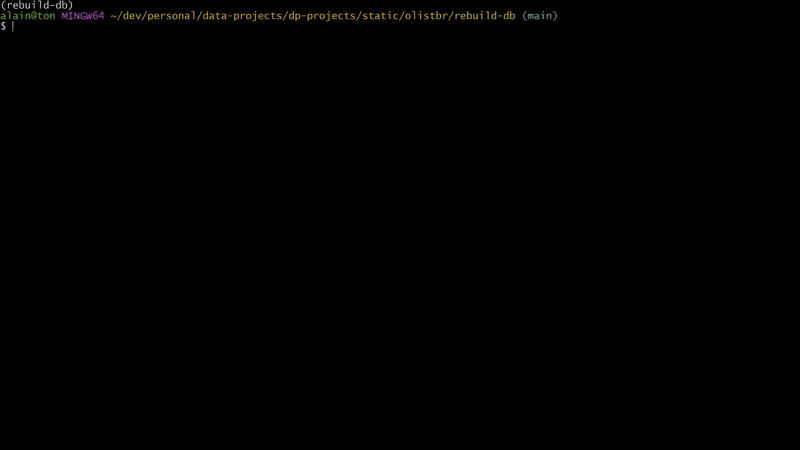
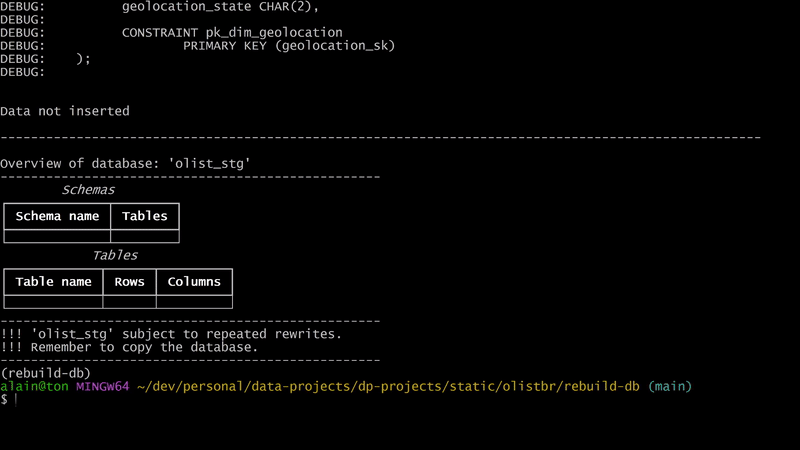

# rebuild-db

## Notable analysis projects

- [Olist](https://github.com/alainfkhan/data-projects-projects/blob/main/static/olistbr/README.md)
    - [**rebuild-db**](https://github.com/alainfkhan/data-projects-projects/blob/main/static/olistbr/rebuild-db/README.md)
- [Restaurant Business Online](https://github.com/alainfkhan/data-projects-projects/blob/main/macos/bogacz-res/README.md)

---

- Running `rebuild-db` drops and rebuilds a staging database `olist_stg`, and inserts data from this project into created tables.
- The created staging database `olist_stg` is intended to be copied and should not be used for analysis since it's susceptible to frequent rewrites and hence potential data loss.
- `rebuild-db` uses `uv` as the python package manager.

## Setup the virtual environment

Go to the project directory:
```bash
cd rebuild-db
```

Remember to deactivate any connected-to virtual environments:
```bash
deactivate
conda deactivate
```

Sync the environment using `uv`:
```bash
uv sync
```

## Rebuild the database by running `src`

Run `src` to rebuild the database:
```bash
make run
# or
uv run src
```

> [!NOTE]
> - You could be on debug mode.
> - To exit debug mode, go to [`src/__main__.py`](https://github.com/alainfkhan/data-projects-projects/blob/main/static/olistbr/rebuild-db/src/__main__.py).
> - Find the variable `execute` just after imports and before `def main() -> None:`.
> - Change the bool of `execute` from `False` to `True`.
> - Change the bools of any of the other debug variables as required.
> - Run `src` to rebuild the database.
> - Then revert `execute` back to `False` to avoid any accidental rebuilds.
> - Do not use the created staging database for analysis.
> - Copy the staging database and use that for analysis.

### Running this program


<details>

<summary>View the database overview</summary>

```txt
Overview of database: 'olist_stg'
--------------------------------------------------
        Schemas
┏━━━━━━━━━━━━━┳━━━━━━━━┓
┃ Schema name ┃ Tables ┃
┡━━━━━━━━━━━━━╇━━━━━━━━┩
│ sales       │ 8      │
│ marketing   │ 2      │
│ logistics   │ 1      │
└─────────────┴────────┘
                              Tables
┏━━━━━━━━━━━━━━━━━━━━━━━━━━━━━━━━━━━━━━━━━━━━━┳━━━━━━━━━┳━━━━━━━━━┓
┃ Table name                                  ┃ Rows    ┃ Columns ┃
┡━━━━━━━━━━━━━━━━━━━━━━━━━━━━━━━━━━━━━━━━━━━━━╇━━━━━━━━━╇━━━━━━━━━┩
│ sales.dim_customers                         │ 99441   │ 5       │
│ sales.dim_sellers                           │ 3095    │ 4       │
│ sales.dim_product_category_name_translation │ 71      │ 2       │
│ sales.dim_products                          │ 32951   │ 9       │
│ sales.fact_orders                           │ 99441   │ 8       │
│ sales.fact_order_items                      │ 112650  │ 7       │
│ sales.fact_order_payments                   │ 103886  │ 5       │
│ sales.fact_order_reviews                    │ 99224   │ 7       │
│ marketing.fact_marketing_qualified_leads    │ 8000    │ 4       │
│ marketing.fact_closed_deals                 │ 842     │ 14      │
│ logistics.fact_geolocation                  │ 1000163 │ 6       │
└─────────────────────────────────────────────┴─────────┴─────────┘

```
</details>

- Run `src`
- This generates dynamic sql commands that is sent to the connected database.
- The configuration file [`src/configs/connection.yml`](src/configs/connection.yml) defines the connection string used to connect to a server. This can be configured by the user.
- The database configuration file [`src/configs/db_config.yml`](src/configs/db_config.yml) defines the table schemas for this dataset.
    - This configuration file was created manually. Column data types, and constraints were determined from a previous analysis on the csv files.
- The database overview queries the database as it is.
- Notice the file `olist_geolocation_dataset.csv` takes the longest time to process since it has the table with the most rows with `1000163` rows.

#### In debug mode:


> [!NOTE]
> - The gif above shows running this program `rebuild-db` in debug mode (with `execute = False`)
> - The database overview that appears at the end queries the database as it is.
> - The reason it shows no tables existing is because this program was ran before creating the tables.
> - If there was a lone table currently existing in the database, the database overview would show it.

### Data validation
