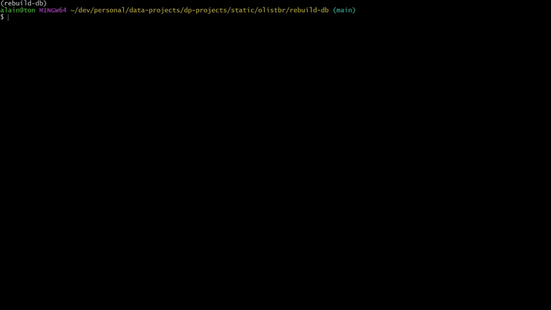

# rebuild-db

## Notable analysis projects

- [Olist](https://github.com/alainfkhan/data-projects-projects/blob/main/static/olistbr/README.md)
  - [**rebuild-db**](https://github.com/alainfkhan/data-projects-projects/blob/main/static/olistbr/rebuild-db/README.md)
- [Restaurant Business Online](https://github.com/alainfkhan/data-projects-projects/blob/main/macos/bogacz-res/README.md)

## Project overview

1. [Run rebuild-db](#rebuild-the-database-by-running-src)
2. [Copy the database](#copy-the-database)

Running `rebuild-db`:

1. Rebuilds a staging database `olist_stg` in SQL Server.
   - Drops a database `olist_stg` if it exists.
   - Creates a new empty database `olist_stg`.
2. Creates the schema and tables,
   - as defined by [`src/configs/db_config.yml`](src/configs/db_config.yml)
3. Inserts the project data into the tables.
   - From the dataset in [`../data/raw`](../data/raw/)
4. Generates supplementary tables:
   - [`utils.dim_date`](queries/rebuild-db/create-dim_date.sql)
   - [`utils.dim_time`](queries/rebuild-db/create-dim_time.sql)
5. Ingests supplementary geolocation data:
   - `logistics.dim_cep`
   - `staging.dim_cep_iz_B`

> [!IMPORTANT]
> The created staging database `olist_stg` is intended to be copied and saved as `olist`, and should not be used for analysis since it's susceptible to frequent rewrites and hence also to potential data loss.

`rebuild-db` uses `uv` as the python package manager.

---

## Setup the virtual environment

Go to the project directory:

```bash
cd rebuild-db
```

Remember to deactivate any connected-to virtual environments:

```bash
deactivate
conda deactivate
```

Sync the environment using `uv`:

```bash
uv sync
```

## Rebuild the database by running `src`

Run `src` to rebuild the database:

```bash
make run
# or
uv run src
```

> [!NOTE]
>
> - You could be on debug mode.
> - To exit debug mode:
>   1. Go to [`src/__main__.py`](src/__main__.py)
>   2. Find the variable `execute` just after imports and before `def main() -> None:`.
>   3. Change the bool of `execute` from `False` to `True`.
>   4. Change the bools of any of the other debug variables as required.
>   5. Run `src` to rebuild the database.
>   6. You can choose to revert `execute` back to `False` to avoid any accidental rebuilds.
> - Do not use the created staging database for analysis.
> - Copy the staging database and use that for analysis.

### Running this program



<details>

<summary>View the database overview</summary>

```txt
Overview of database: 'olist_stg'
--------------------------------------------------
        Schemas
┏━━━━━━━━━━━━━┳━━━━━━━━┓
┃ Schema name ┃ Tables ┃
┡━━━━━━━━━━━━━╇━━━━━━━━┩
│ sales       │ 8      │
│ marketing   │ 2      │
│ logistics   │ 2      │
│ utils       │ 2      │
│ staging     │ 1      │
└─────────────┴────────┘
                              Tables
┏━━━━━━━━━━━━━━━━━━━━━━━━━━━━━━━━━━━━━━━━━━━━━┳━━━━━━━━━┳━━━━━━━━━┓
┃ Table name                                  ┃ Rows    ┃ Columns ┃
┡━━━━━━━━━━━━━━━━━━━━━━━━━━━━━━━━━━━━━━━━━━━━━╇━━━━━━━━━╇━━━━━━━━━┩
│ sales.dim_customers                         │ 99441   │ 5       │
│ sales.dim_sellers                           │ 3095    │ 4       │
│ sales.dim_product_category_name_translation │ 71      │ 2       │
│ sales.dim_products                          │ 32951   │ 9       │
│ sales.fact_orders                           │ 99441   │ 8       │
│ sales.fact_order_items                      │ 112650  │ 7       │
│ sales.fact_order_payments                   │ 103886  │ 5       │
│ sales.fact_order_reviews                    │ 99224   │ 7       │
│ marketing.fact_marketing_qualified_leads    │ 8000    │ 4       │
│ marketing.fact_closed_deals                 │ 842     │ 14      │
│ logistics.fact_geolocation                  │ 1000163 │ 6       │
│ utils.dim_date                              │ 2557    │ 17      │
│ utils.dim_time                              │ 86400   │ 31      │
│ logistics.dim_cep                           │ 995090  │ 6       │
│ staging.dim_cep_iz_B                        │ 849343  │ 5       │
└─────────────────────────────────────────────┴─────────┴─────────┘
--------------------------------------------------
Successfully rebuilt 'olist_stg'.
!!! 'olist_stg' subject to repeated rewrites.
!!! Remember to copy the database.
--------------------------------------------------

```

</details>

- View the piped [output](docs/stdout/cmd_execute.txt).
- Running `src` generates dynamic sql commands that is sent to the connected database.
- The [connection configuration file](src/configs/connection.yml) defines the connection variables used to connect to a server.
  - This project currently depends on SQL Server Windows Authentication to connect to the server.
- The [database configuration file](src/configs/db_config.yml) defines the table schemas for this dataset.
  - The information in this configuration file was manually typed.
  - Column data types, and constraints were determined from a [preliminary analysis](#data-type-validation) on this dataset.
- The database overview queries the database as it is.
- Notice the file `olist_geolocation_dataset.csv` takes the longest time to process since it has the table with the most rows with `1000163` rows.

### Data-type validation

- An inference function [`infer_dtypes()`](src/utils/infer.py) was used to help determine the ideal SQL server column data types that improve query memory allocations.
- This function inputs a pandas dataframe and outputs an attributes table that describe each column.
- Other functions, in [`src/utils/measures.py`](src/utils/measures.py), were used to determine other attributes like:
  - finding the max `precision` and `scale` of a supposed `DECIMAL` datatype.
  - how similar a string is from another using the [Dice-Sørensen coefficient](https://en.wikipedia.org/wiki/Dice-S%C3%B8rensen_coefficient).

Suppose we would like to find the SQL server data types of the columns from `olist_customers_dataset.csv`.
We consider using a `.ipynb` jupyter notebook for analysis.

```py
# As an example for illustration
import pandas as pd

filepath = 'olist_customers_dataset.csv'
df = pd.read_csv(filepath, dtype=object)
df_attributes = infer_dtype(df)
df_attributes
```

<div>
<table border="1" class="dataframe">
  <thead>
    <tr style="text-align: right;">
      <th></th>
      <th>has_unique_entries</th>
      <th>has_nulls</th>
      <th>where_nulls</th>
      <th>total_nulls</th>
      <th>sorted_chars_used</th>
      <th>total_unique_chars_used</th>
      <th>has_ascii</th>
      <th>has_non_ascii</th>
      <th>has_prefix_zero</th>
      <th>dice_sim_to_ascii</th>
      <th>dice_sim_to_non_ascii</th>
      <th>min_str_value</th>
      <th>max_str_value</th>
      <th>entry_lengths</th>
      <th>total_unique_entry_lengths</th>
      <th>max_entry_length</th>
      <th>is_fixed_length</th>
      <th>chars_used_subset_of_numeric</th>
      <th>has_prefix_dash</th>
      <th>has_digits</th>
      <th>has_hex_digits</th>
      <th>has_decimal</th>
      <th>dice_sim_to_digits</th>
      <th>dice_sim_to_hex_digits</th>
      <th>min_numeric_value</th>
      <th>max_numeric_value</th>
      <th>has_dash</th>
      <th>has_colon</th>
      <th>has_space</th>
      <th>has_exactly_two_entries</th>
    </tr>
  </thead>
  <tbody>
    <tr>
      <th>customer_id</th>
      <td>1</td>
      <td>0</td>
      <td>[]</td>
      <td>0</td>
      <td>0123456789abcdef</td>
      <td>16</td>
      <td>1</td>
      <td>0</td>
      <td>1</td>
      <td>0.275862</td>
      <td>0.0</td>
      <td>00012a2ce6f8dcda20d059ce98491703</td>
      <td>ffffe8b65bbe3087b653a978c870db99</td>
      <td>[32]</td>
      <td>1</td>
      <td>32</td>
      <td>1</td>
      <td>0</td>
      <td>0</td>
      <td>1</td>
      <td>1</td>
      <td>0</td>
      <td>0.769231</td>
      <td>0.842105</td>
      <td><NA></td>
      <td><NA></td>
      <td>0</td>
      <td>0</td>
      <td>0</td>
      <td>0</td>
    </tr>
    <tr>
      <th>customer_unique_id</th>
      <td>0</td>
      <td>0</td>
      <td>[]</td>
      <td>0</td>
      <td>0123456789abcdef</td>
      <td>16</td>
      <td>1</td>
      <td>0</td>
      <td>1</td>
      <td>0.275862</td>
      <td>0.0</td>
      <td>0000366f3b9a7992bf8c76cfdf3221e2</td>
      <td>ffffd2657e2aad2907e67c3e9daecbeb</td>
      <td>[32]</td>
      <td>1</td>
      <td>32</td>
      <td>1</td>
      <td>0</td>
      <td>0</td>
      <td>1</td>
      <td>1</td>
      <td>0</td>
      <td>0.769231</td>
      <td>0.842105</td>
      <td><NA></td>
      <td><NA></td>
      <td>0</td>
      <td>0</td>
      <td>0</td>
      <td>0</td>
    </tr>
    <tr>
      <th>customer_zip_code_prefix</th>
      <td>0</td>
      <td>0</td>
      <td>[]</td>
      <td>0</td>
      <td>0123456789</td>
      <td>10</td>
      <td>1</td>
      <td>0</td>
      <td>1</td>
      <td>0.181818</td>
      <td>0.0</td>
      <td>01003</td>
      <td>99990</td>
      <td>[5]</td>
      <td>1</td>
      <td>5</td>
      <td>1</td>
      <td>1</td>
      <td>0</td>
      <td>1</td>
      <td>1</td>
      <td>0</td>
      <td>1.0</td>
      <td>0.625</td>
      <td>1003</td>
      <td>99990</td>
      <td>0</td>
      <td>0</td>
      <td>0</td>
      <td>0</td>
    </tr>
    <tr>
      <th>customer_city</th>
      <td>0</td>
      <td>0</td>
      <td>[]</td>
      <td>0</td>
      <td>'-14abcdefghijklmnopqrstuvwxyz</td>
      <td>31</td>
      <td>1</td>
      <td>0</td>
      <td>0</td>
      <td>0.473282</td>
      <td>0.0</td>
      <td>abadia dos dourados</td>
      <td>zortea</td>
      <td>[3, 4, 5, 6, 7, 8, 9, 10, 11, 12, 13, 14, 15, ...</td>
      <td>28</td>
      <td>32</td>
      <td>0</td>
      <td>0</td>
      <td>0</td>
      <td>1</td>
      <td>1</td>
      <td>0</td>
      <td>0.097561</td>
      <td>0.301887</td>
      <td><NA></td>
      <td><NA></td>
      <td>1</td>
      <td>0</td>
      <td>1</td>
      <td>0</td>
    </tr>
    <tr>
      <th>customer_state</th>
      <td>0</td>
      <td>0</td>
      <td>[]</td>
      <td>0</td>
      <td>ABCDEFGIJLMNOPRST</td>
      <td>17</td>
      <td>1</td>
      <td>0</td>
      <td>0</td>
      <td>0.290598</td>
      <td>0.0</td>
      <td>AC</td>
      <td>TO</td>
      <td>[2]</td>
      <td>1</td>
      <td>2</td>
      <td>1</td>
      <td>0</td>
      <td>0</td>
      <td>0</td>
      <td>1</td>
      <td>0</td>
      <td>0.0</td>
      <td>0.307692</td>
      <td><NA></td>
      <td><NA></td>
      <td>0</td>
      <td>0</td>
      <td>0</td>
      <td>0</td>
    </tr>
  </tbody>
</table>
</div>

- The dataframe `df` from `olist_customers_dataset.csv` has columns:
  - `customer_id`
  - `customer_unique_id`
  - `customer_zip_code_prefix`
  - `customer_city`
  - `customer_state`
- The outputted attributes table `df_attributes` shown above has
  - rows as the column names in the dataframe `df`
  - and columns that describe them:
    - `has_unique_entries`
    - `has_nulls`
    - `where_nulls`
    - `total_nulls`
    - `sorted_chars_used`
    - ...

We use the attributes table `df_attributes` to help us determine the column datatypes before we create the tables.

In the attributes table `df_attributes`, consider row `customer_id`:

- On constraints:
  - `has_unique_entries` = `1`
  - `has_nulls` = `0`
  - is a natural key to `olist_customers_dataset.csv`.
  - No other columns have unique entries.
  - We can be confident that the `PRIMARY KEY` is only `customer_id`.
- On data type:
  - `sorted_chars_used` = `0123456789abcdef`
  - contains alphabet characters and so has to be a [`Character string`](https://learn.microsoft.com/en-us/sql/t-sql/data-types/data-types-transact-sql?view=sql-server-ver17#character-strings) data type.
    - either: `CHAR`, `NCHAR`, `VARCHAR`, `NVARCHAR`, `TEXT`
    - reject: `TEXT`
  - `has_ascii` = `1`
  - `has_non_ascii` = `0`
  - has ascii characters and only ascii characters.
    - reduce to: `CHAR`, `VARCHAR`
  - `is_fixed_length` = `1`
    - choose: `CHAR`
  - `maximum_entry_length` = `32`.
  - We can be confident that `customer_id` has the datatype: `CHAR(32)`

Then, when creating the table:

- Manually type the table configuration in [`src/configs/db_config.yml`](src/configs/db_config.yml):

```yml
# this is manually typed:

olist_stg:
- sales:
  - dim_customers:
    filename: olist_customers_dataset.csv
    type: dim
    columns:
      - customer_id:
        dtype: CHAR(32)
        nullable: false
      # ...other columns...
    constraints:
      - pk_dim_customers
        type: PRIMARY KEY
        columns:
        - customer_id
```

- The program will later generate the following sql string:

```sql
-- this is generated:

CREATE TABLE sales.dim_customers(
  customer_id CHAR(32) NOT NULL,
  -- ...other columns...

  CONSTRAINT pk_dim_customers
    PRIMARY KEY (customer_id)
)
```

- Analyse the other columns in this table.
- Repeat for all other tables.
- You will then have the ideal SQL Server column data types for all tables that optimise query memory allocation.

**Q**: Why not just write the sql directly?

**A**: We would like the data-type inferencing to be automated in future iterations of a flavour of this project. The yaml configuration acts as a storage space for table schemas, that communicates to the program.

#### A note on forgone constraints:

- A `FOREIGN KEY` constraint requires a 1-1 or 1-many relationship.
- Columns with entries that cannot be reached cannot have the `FOREIGN KEY` constraint.
- Some foreign keys as defined by the [Olist ERD](../references/img/HRhd2Y0%20-%20Imgur.png) were not implemented since it breaks the requirement.
- The relationship is noted but is not coded in creating the tables.
- Tables that didn't implement foreign keys:
  - `dim_products`
  - `fact_order_payments`
  - `fact_order_reviews`
  - `fact_closed_deals`

#### A note on data integrity:

The SQL datatypes where chosen in such a way that supposes the database as a production database that expects more data.

Notes:

- Column names: `product_name_lenght` and `product_description_lenght` from table `dim_products` were purposefully not corrected.
- Columns with payment values needing at most 2 decimal places were given more decimal places (at most 4) for free (without any negative effect on storage since the `DECIMAL` storage is [binned](https://learn.microsoft.com/en-us/sql/t-sql/data-types/decimal-and-numeric-transact-sql?view=sql-server-ver17#s-scale)).

## Copy the database

For the last step, manually copy the created database `olist_stg` and save it as `olist` and continue with the analysis.

Some tables are cleaned further in analysis.
